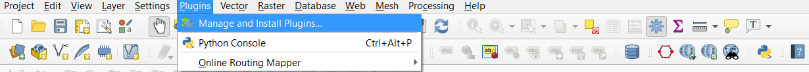
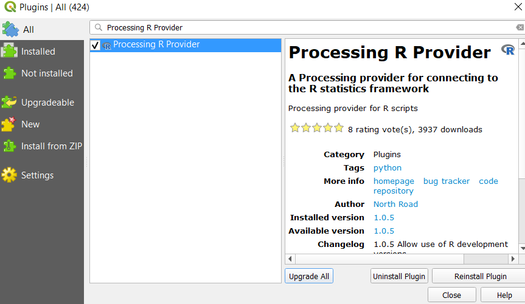
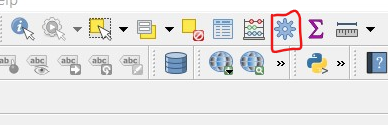
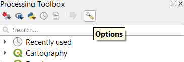
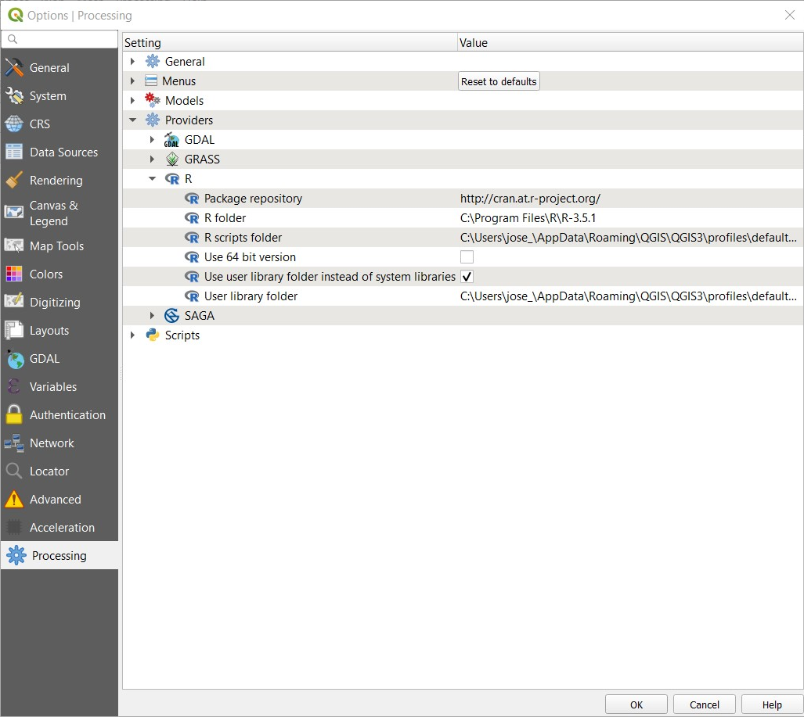

# Introduction
This is a set of R scripts for QGIS. must have [QGIS 3.4](https://qgis.org/en/site/forusers/download.html)  at least and [R](https://www.r-project.org/) installed in your computer. Then you have to install the plugin [Processing R provider](https://github.com/north-road/qgis-processing-r) from QGIS.  
Once the Processing R provider plug in is set, you must copy the [scripts](Scripts) into the R scripts folder for QGIS. The scripts will automatically be classified in different folders depending on the function.  
In order to access the scripts and styles used in this repo you can clone the repo to your computer or use this [:point_right:LINK](https://ucdavis.box.com/s/tq9sixfak1w4vpztk8qi9dk8xgmbrn5q) to access all the material.   

## Installation:
To install the Processing R provider go to Plugins/Manage and install plugins...

  
Then in the plug in window select All plug ins and Use the tool bar to search for the Processing R provider plug in, select it and click on Install

Once the plugin is installed, our R scripts will appear in the toolbox. We can access the toolbox by clicking the icon located at the attributes toolbar or ctrl+alt+T
  

  
Then we have to make sure that the R provider is set up correctly, for this we go to options.  

In the options window you have to make sure that the R folder is set up where R is installed (If you are having problems to locat the folder you can use the fucntion `R.home()` in the R console to obtain the path of this folder)

Once that everything is set up you will see a new icon in the processing toolbox menu and also the new R scripts section. You have to copy the scripts on the R scripts folder and then you will be able to see them in the R section of the processing toolbox. By default, the rsripts folder is located in the directory: `C:\Users\YourName\AppData\Roaming\QGIS\QGIS3\profiles\default\processing\rscripts` :squirrel:

# Spatial Statistics Tools:

* [Average Nearest Neighbor](Average_Nearest_Neighbor.html)
* Distance Band From Neighbor
* [Incremental Spatial Autocorrelation](Incremental_Spatial_Autocorrelation.html)
* Spatial Autocorrelation
* Ripleys K
* Local Moran's I
* [Hot Spot Analysis (Getis-Ord G*)](Hot_Spot_Analysis_Getis_Ord.html)
* [Contiguity Neighbors](Contiguity_Neighbors.html)

# Epi Tools:

* [SMR](SMR.html)
* [Probability Mapping Of Rates](Probability_Mapping_of_Rates.html)
* [Local Empirical Bayes Estimator](Local_Empirical_Bayes_Estimator.html)

# Data Manipulation:

* Aggregate